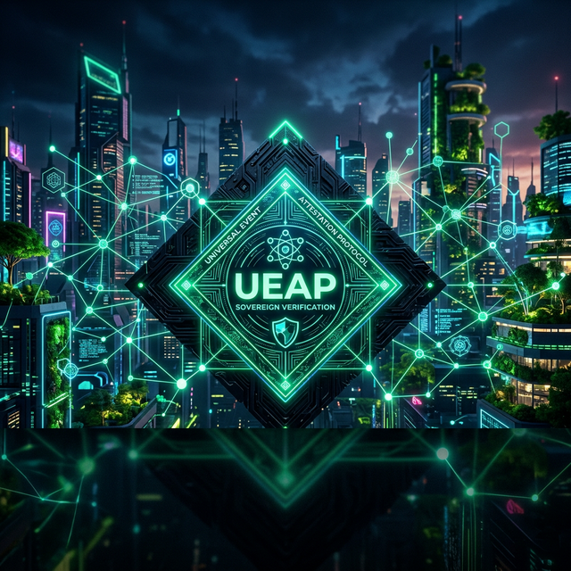

# Universal Event Attestation Protocol (UEAP)

**An experimental open protocol model for cryptographically verifiable event attestations**

---

## Overview

UEAP defines a domain-agnostic model for transforming observations and evidence into cryptographically verifiable attestations.

**Core pipeline:**

`Reality → Observation → Evidence → Canonical Representation → Commitment → Proof → Attestation → Registry → Verification → Verified State`

UEAP separates protocol mechanics from domain semantics. Domain adapters may transform source-specific observations into UEAP representations without making those domain semantics part of the core.

> **Security boundary:** UEAP cryptography verifies declared cryptographic relationships. It does not independently establish physical truth, sensor accuracy, issuer honesty, semantic correctness, or the absence of compromised infrastructure.

## Specification

- [UEAP Specification v0.2](./spec/UEAP_SPEC_v0.2.md)
- [Event Model](./spec/event-model.md)
- [Attestation Model](./spec/attestation-model.md)
- [Verification Model](./spec/verification-model.md)
- [Conformance](./spec/conformance.md)
- [Terminology](./spec/terminology.md)
- [Implementation Status](./spec/implementation-status.md)

## Repository status

This repository contains an **experimental protocol specification, reference code, and domain-specific experiments**.

The specification is the normative boundary where explicitly stated. Existing code is not automatically normative: components are classified as reference implementation, experimental implementation, stub, or domain extension.

### Domain extensions

GreenProof, GuardTag, ESG circuits, oracle integrations, and other application-specific components are examples/extensions and are not part of the UEAP core unless explicitly incorporated into a future specification.

## Research boundary

Questions concerning event identity, evidence binding, provenance commitments, canonicalization profiles, and interoperability remain under research. Unresolved design choices are intentionally not presented as settled protocol requirements.

## Status

**v0.2 — Experimental Specification**

This version is not a claim of protocol stability, production readiness, novelty, or patentability.
